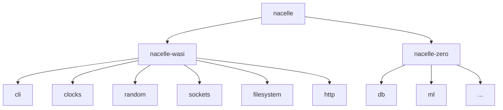

  <!-- <a href="https://github.com/zerocore-ai/nacelle-wasi" target="_blank">
    </img>
  </a> -->

  <h1 align="center">nacelle-wasi</h1>

  <!-- 

    
    
    
    
    
  
 -->

**nacelle** is a runtime and a collection of libraries for running WASI and zero-enabled applications. It introduces a new capability system that diverges a bit from the traditional WASI capabilities.

### Crate Dependency Graph

 

> [!WARNING]
> This project is in early development and is not yet ready for production use.

##

## Outline

- [Acknowledgments](#acknowledgments)
- [License](#license)

## Acknowledgments

This project makes use of code from the [wasmtime][wasmtime] project. The `wasmtime` project is an impactful open-source initiative that enables us to achieve our goals more efficiently by leveraging their robust WebAssembly runtime implementation.

## License

This project is licensed under the [Apache License 2.0](./LICENSE).

[apache]: https://www.apache.org/licenses/LICENSE-2.0
[zerocore]: https://github.com/zerocore-ai/zerocore
[wasi]: https://wasi.dev/
[wasmtime]: https://github.com/bytecodealliance/wasmtime
[cap_std]: https://github.com/bytecodealliance/cap-std
